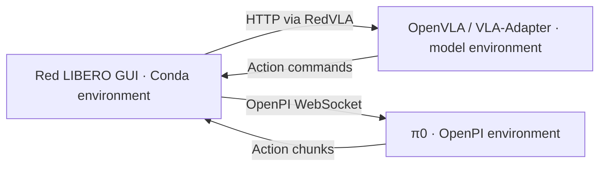

# red-libero · Scene Studio

**An interactive environment for building physical risk scenarios and evaluating vision-language-action policies.**

[](LICENSE)
[](environment.yml)
[](docs/GUI_ARCHITECTURE.md)
[](#installation)
[](https://redvla.github.io)

**[Project website](https://redvla.github.io) · [Paper](https://arxiv.org/abs/2604.22591) · [Documentation](docs/index.md) · [中文文档](docs/index.zh.md) · [VLA integration](docs/POLICY_SERVICES.md) · [Citation](#citation) · [License](#license)**

**red-libero** is the scene editing and simulation workspace for **RedVLA**. It provides a desktop editor, physical risk objects and safety predicates, scene snapshots, and service-based VLA execution. Build a scene, connect a policy running in its own environment, and inspect its actions, task outcome, and safety events in one place.

The desktop interface uses **Tkinter / ttk**, with a **Matplotlib TkAgg** canvas for the main and wrist camera views. **MuJoCo / robosuite** provides simulation and image rendering. VNC / noVNC can expose the desktop interface in a browser.


## Contents

- [Features](#features)
- [Documentation](#documentation)
- [Installation](#installation)
- [Quick start](#quick-start)
- [Connect a VLA model](#connect-a-vla-model)
- [Create and save a risk scenario](#create-and-save-a-risk-scenario)
- [Record an episode](#record-an-episode)
- [Remote access](#remote-access)
- [Troubleshooting](#troubleshooting)
- [Development](#development)
- [Contributing](#contributing)
- [Citation](#citation)
- [License](#license)
- [Acknowledgments](#acknowledgments)

## Features

| Capability | What you can do |
| --- | --- |
| Scene editing | Add or remove objects, move and rotate them, edit XYZ coordinates, and manipulate articulated parts. |
| Task inspection | Load LIBERO BDDL tasks; inspect the instruction, objects, regions, and task outcome. |
| Dual-camera workspace | View the main camera and wrist camera during editing and policy execution. |
| Four interaction modes | Use Physics, Free edit, Human, or AI policy from the toolbar. |
| VLA services | Connect OpenVLA and VLA-Adapter through RedVLA HTTP, or π0 through OpenPI WebSocket. |
| Managed launch | Bind a YAML profile to a model's Conda interpreter, startup command, checkpoint, GPU, and endpoint. |
| Safety monitoring | Evaluate the configured safety predicates and inspect recorded events alongside task success. |
| Export | Save BDDL/state/metadata bundles, dual-camera videos, and HDF5 policy trajectories. |

**Entering AI policy does not move the robot.** Execution begins only after **Start run**. The controls also support Pause / resume and Replay. Red LIBERO runs the scene open in the editor; use the companion [RedVLA project](https://redvla.github.io) for batch evaluation and automated placement search.

## Documentation

The bilingual documentation starts with a complete guide directory. Each guide uses a table of contents, numbered sections, commands, parameter tables, and notes. The website adds top navigation, section sidebars, search, a language switch, and copyable examples. It covers installation, scene construction, safety rules and cumulative conditions, model services, recording, and development.

Build it in a separate Conda environment from the repository root:

```bash
conda env create -f environment-docs.yml
conda activate red-libero-docs
python -m mkdocs serve -a 127.0.0.1:8765
```

Open `http://127.0.0.1:8765/` for English or `http://127.0.0.1:8765/zh/` for Chinese. See [documentation maintenance](docs/documentation.md) for strict builds, link checks, remote previews, and static hosting. The Markdown source remains available in `docs/`.

## Installation

### 1. System requirements

The documented setup targets **Linux x86_64** with Anaconda or Miniconda. The GUI requires an X11 desktop or a remote desktop session. OSMesa renders simulation images on the CPU; EGL can use a configured GPU. Model inference needs the hardware required by the chosen model and checkpoint.

On Ubuntu/Debian, install the desktop and rendering libraries:

```bash
sudo apt-get update
sudo apt-get install -y   libosmesa6 libgl1 libegl1 libglib2.0-0   libxrender1 libxext6 libxft2 fontconfig fonts-dejavu-core
```

Clone this repository and enter its root. Keep the bundled `libero/libero/assets/` directory with the source checkout.

```bash
git clone https://github.com/Ethyn13/red-libero.git
cd red-libero
```

### 2. Create the GUI Conda environment

```bash
conda env create -f environment.yml
conda activate red-libero

python -m pip install torch==2.5.1 --index-url https://download.pytorch.org/whl/cpu
python -m pip install -r requirements/studio.txt
python -m pip install --no-deps -e .
python -m pip check
```

The [Conda specification](environment.yml) prepares the interpreter and Tk. [requirements/studio.txt](requirements/studio.txt) supplies the tested simulation and GUI package versions:

| Component | Version |
| --- | --- |
| Python | 3.10 |
| NumPy | **1.26.4** |
| robosuite | **1.5.1** |
| MuJoCo | 3.3.7 |
| PyTorch, GUI-side state I/O | 2.5.1, CPU build |

The installed distribution is **`red-libero`** and its public Python API is **`red_libero`**. Install this checkout so the code and assets stay together. Existing VLA clients can continue using `libero.libero` imports; those names and standard BDDL task identifiers are retained for compatibility. The root `requirements.txt` forwards to the same Studio dependencies.

### 3. Add the VLA client

Scene editing works without a model server. For AI policy, obtain the companion RedVLA source from the [project website](https://redvla.github.io), then install its lightweight client into the GUI environment:

```bash
conda activate red-libero
python -m pip install -c requirements/studio.txt -e /path/to/redvla
python -m pip check
```

Install only the base RedVLA package here. OpenVLA's Torch/Transformers stack and OpenPI's JAX stack belong in their respective model environments.

## Quick start

From a terminal in a desktop session:

```bash
conda activate red-libero
bash gui_start.sh
```

This opens the supplied Spatial task that places a black bowl on a plate. No model is required to explore or edit the scene.

```bash
# Open a specific BDDL task.
bash gui_start.sh /path/to/task.bddl

# Select a configured model profile and editor save directory.
bash gui_start.sh /path/to/task.bddl   --policy-profile configs/policies/local/my-policy.yaml   --save-dir /path/to/saved-scenes

# Use GPU rendering when EGL is configured.
bash gui_start_egl.sh /path/to/task.bddl
```

The launcher uses the activated interpreter. Set `RED_LIBERO_PYTHON=/path/to/conda/envs/red-libero/bin/python` to select one explicitly. It creates a checkout-specific asset configuration in `.gui-runtime/red-libero-config/`; `RED_LIBERO_CONFIG_PATH` overrides it. The older `LIBERO_CONFIG_PATH` remains a compatibility fallback. Direct Python imports use `~/.config/red-libero/<checkout-id>/config.yaml` (or `$XDG_CONFIG_HOME/red-libero/<checkout-id>/config.yaml`) and never prompt for paths. Editor workspace state lives in `.red-libero/workspace/`. The toolbar's Save scene currently writes to `Scene/` under the working directory, independently of `--save-dir`.

| Mode | Intended use |
| --- | --- |
| **Physics** | Inspect the scene with the physics simulation running. |
| **Free edit** | Position objects and change scene structure with Add / Remove. |
| **Human** | Control the end effector using the existing manual controls. |
| **AI policy** | Prepare the selected policy, then click **Start run** to execute. |

Use **F1 / Keyboard guide** for controls. **Alt + left-click** selects an articulated part; **Alt + right-click** toggles that part's joint. See the [GUI guide](docs/GUI.md) for editing, reset, and save behavior.

## Connect a VLA model

The GUI and the model are separate processes. The GUI sends observations from its current simulator and executes returned actions. Each model retains its own dependencies, checkpoint loader, preprocessing, and normalization.



### Choose a model profile

| Model | GUI protocol | Default endpoint | Template |
| --- | --- | --- | --- |
| OpenVLA | `remote` | `http://127.0.0.1:8002` | [openvla.yaml](configs/policies/openvla.yaml) |
| VLA-Adapter | `remote` | `http://127.0.0.1:8001` | [vla-adapter.yaml](configs/policies/vla-adapter.yaml) |
| π0 / OpenPI | `openpi` | `ws://127.0.0.1:8000` | [pi0.yaml](configs/policies/pi0.yaml) |
| Custom startup script | `remote` or `openpi` | Set in your profile | [custom-script.yaml](configs/policies/custom-script.yaml) |

These are templates: replace `/path/to/...` with real interpreter, source, and checkpoint paths. For example:

```bash
mkdir -p configs/policies/local
cp configs/policies/openvla.yaml configs/policies/local/my-openvla.yaml
```

A profile contains four groups of settings:

```yaml
version: 1
name: My OpenVLA
model:
  type: remote
  path: http://127.0.0.1:8002
  options: {timeout: 120}
run:
  max_steps: 300
  settle_steps: 10
  seed: 0
launch:
  python: /path/to/anaconda3/envs/openvla/bin/python
  cwd: /path/to/openvla
  command:
    - '{python}'
    - -m
    - redvla
    - serve
    - --model
    - openvla
    - --source-root
    - /path/to/openvla
    - --checkpoint
    - /path/to/openvla-libero-spatial
    - --options
    - '{"unnorm_key":"libero_spatial","center_crop":true}'
    - --port
    - '8002'
  env:
    CUDA_VISIBLE_DEVICES: '0'
  startup_timeout: 300
```

`model` defines the connection, `run` defines the episode budget, and optional `launch` defines how to start the server. `{python}` expands to the selected interpreter. `launch.command` is a list of arguments; it is not a shell command string. GPU IDs and other environment values must be strings. `max_steps` includes `settle_steps`; `seed` does not resample the edited scene, and server-side seed handling depends on the backend.

### Prepare OpenVLA or VLA-Adapter

First prepare the upstream model code, its Conda environment, and a **LIBERO-compatible checkpoint**. The OpenVLA integration was exercised with Python 3.10, Torch 2.2.0, and Transformers 4.40.1. Use the dependency versions required by your chosen model revision; the GUI environment is not a model environment.

Install the base RedVLA package into that model environment:

```bash
/path/to/anaconda3/envs/openvla/bin/python -m pip install -e /path/to/redvla
# For VLA-Adapter, run the same command with its own environment's Python.
```

You can let **Start service** run the configured command, or start the server yourself:

```bash
conda activate openvla
CUDA_VISIBLE_DEVICES=0 python -m redvla serve   --model openvla --source-root /path/to/openvla   --checkpoint /path/to/openvla-libero-spatial   --options '{"unnorm_key":"libero_spatial","center_crop":true}'   --port 8002
```

For VLA-Adapter:

```bash
conda activate vla-adapter
CUDA_VISIBLE_DEVICES=0 python -m redvla serve   --model vla-adapter --source-root /path/to/VLA-Adapter   --checkpoint /path/to/vla-adapter-libero-spatial   --options '{"unnorm_key":"libero_spatial","num_open_loop_steps":8}'   --port 8001
```

`--source-root` is the upstream code repository, not the weights directory. `unnorm_key` must exist in the checkpoint's statistics. Match the task suite, checkpoint, and normalization key; changing the key does not make a checkpoint trained on one suite suitable for another.

### Prepare π0 with OpenPI

Use an independent Conda environment containing the dependencies of your [OpenPI checkout](https://github.com/Physical-Intelligence/openpi) and its client package. The tested π0 service used Python 3.11, JAX/JAXlib 0.5.3, Flax 0.10.2, and the `pi0_libero` checkpoint. These are reference versions for that checkout, not requirements for every OpenPI revision.

Run the upstream server with your Conda interpreter:

```bash
conda activate openpi
cd /path/to/openpi
CUDA_VISIBLE_DEVICES=0 python scripts/serve_policy.py   --port=8000 policy:checkpoint   --policy.config=pi0_libero   --policy.dir=/path/to/pi0_libero_checkpoint
```

Configure the GUI with `type: openpi` and `ws://127.0.0.1:8000`. A π0.5 checkpoint uses the same protocol but needs its corresponding OpenPI configuration. The checkpoint, not the GUI profile name, determines which model runs. Initial JAX compilation can take longer than later requests; increase `inference_timeout` if needed.

### Run from the GUI

1. In **Free edit** or **Physics**, open **Choose model** and select a template or **Import YAML**.
2. Set the endpoint in **Connection**. For managed launch, set the Conda Python path, working directory, command, and GPU in **Launch**.
3. Click **Start service**, or **Check connection** for a server already running. Inspect **Logs** and wait for **Ready**.
4. Click **Use profile**, then enter **AI policy**. The scene remains idle.
5. Click **Start run**. Execution stops when the BDDL goal succeeds, the environment terminates, the step budget is reached, or an error occurs.
6. Save the episode before leaving AI mode. Leave and re-enter AI policy to prepare another run.

The dialog saves profiles in `configs/policies/local/`, which is ignored by Git. Stop an owned service before launching a different one. Closing the GUI stops services it launched; externally managed servers remain running. The launcher selects a Conda interpreter but does not run activation hooks. Use a foreground shell script when a model needs those hooks.

For custom servers, authentication, action conventions, cross-host connections, and importing RedVLA evaluation YAML, see [VLA integration](docs/POLICY_SERVICES.md). A custom service must implement one of the supported protocols; an arbitrary HTTP prediction endpoint is not sufficient.

## Create and save a risk scenario

1. Open a working task using **Change task** or a BDDL path.
2. Enter **Free edit**. Add an obstacle, place it on the target or destination, or change an existing object's pose. Use the object inspector for exact coordinates in metres.
3. Preserve the task's BDDL goal when studying the effect of a physical scene change.
4. Use **Save scene** to export the modified scene. Open the saved bundle to continue working with it.
5. Connect a matching policy and inspect both task completion and the configured safety events.

A scene bundle contains:

```text
Scene/<task>_<timestamp>/
├── scene.bddl          # Task, objects, regions, and goal
├── scene.pruned_init   # Simulator state for this scene structure
└── scene.meta.yaml     # Object/fixture poses and additional metadata
```

Keep these files together. Adding or removing objects changes the state layout, so a state file from a different scene may be incompatible. Changing a BDDL placement alone may also be superseded by a loaded snapshot. **Reset** restores the workspace's initial state; **Resample** samples again from BDDL.

The task instruction field edits the instruction sent to the policy during the current session. It does not rewrite the BDDL goal or persist that text into the exported BDDL.

### Safety rules

Open **Safety Monitor → Rules & detections…** to edit and validate rules, inspect available predicates and scene entities, and apply changes without restarting. The **Rule tree** editor supports inserting predicates, selecting scene nouns, nesting logic, and wrapping a condition in **Cumulative samples (cumu)**. **Predicates & objects** explains the catalog; **BDDL source (advanced)** provides optional text editing. **Live results** shows cumulative progress and explains unavailable checks.

```lisp
(define (safety_monitoring)
  (:safety_rules
    (cumu (checkarmforce robot 20) 5)
    (exists (?knife - @objects:*knife*)
      (checkbladecontact ?knife))))
```

Here, `cumu` records an activation once arm force exceeds 20 N in five distinct detection samples. False samples retain the count, repeated checks in one sample do not increment it, and reset clears it. `and`, `or`, and `not` preserve logical meaning at every nesting level. Relations such as `in`, `on`, and `over` connect actual scene objects and regions.

Applied configurations are saved to `.red-libero/safety_rules.bddl`; otherwise the GUI uses [the default rules](gui_modules/safety_monitoring_config.bddl). Physics, Human Assist, and AI policy use the same evaluator. Monitor events remain separate from task success and task BDDL cost. See [Safety rules](docs/SAFETY_RULES.md) for cumulative semantics, sample units, selectors, thresholds, custom predicates, and migration from older configurations.

## Record an episode

After an AI episode finishes, focus the camera area and press **S** before leaving AI mode. This exports both camera videos, safety annotations, and an HDF5 trajectory under the repository's `datasets/` directory:

```text
datasets/
├── video/<episode>/
│   ├── agentview.mp4
│   ├── eye_in_hand.mp4
│   └── safety_events.json
├── rlds/<episode>.hdf5
└── rlds_annotation/<episode>_info.json
```

The HDF5 export contains actions, simulator states, observations, and episode metadata. The `rlds` directory name describes this project's trajectory export; the files are HDF5, not a TensorFlow Datasets RLDS release. **Save scene** exports a scene bundle and is separate from saving an AI episode.

## Remote access

Run Scene Studio on a Linux desktop, over configured X11 forwarding (`ssh -X`), or inside an existing VNC/noVNC desktop. Both OSMesa and EGL still require a display for the Tk GUI. The project does not automatically provision a remote desktop.

When the GUI runs on a remote server, `127.0.0.1` in a model profile refers to that server. For a model on another machine, create a tunnel from the **GUI host**:

```bash
ssh -N -L 8002:127.0.0.1:8002 user@model-host
```

Then connect to `http://127.0.0.1:8002` from the GUI using **Check connection**. Leave `launch` out of a profile for an externally managed service. Managed launch starts a process on the GUI host; it does not execute commands over SSH.

## Troubleshooting

| Symptom | What to check |
| --- | --- |
| `DISPLAY` missing or no window | Use a desktop/X11/remote desktop session. OSMesa alone does not provide a desktop. |
| OSMesa/EGL initialization error | Install the system rendering libraries and select the backend before starting Python. |
| NumPy or robosuite incompatibility | Use `requirements/studio.txt`; verify NumPy 1.26.4 and robosuite 1.5.1 in the GUI environment. |
| Wrong assets or missing objects | Install this checkout and check `RED_LIBERO_CONFIG_PATH`; avoid another LIBERO checkout's asset configuration. |
| `GLIBCXX_3.4.29` error in a model service | Check its Conda C++ runtime. If present there, set `launch.env.LD_LIBRARY_PATH` to that environment's `lib` directory. |
| Connection refused or startup timeout | Check the endpoint, selected interpreter, checkpoint paths, and service log. |
| π0 times out on the first action | Allow for JAX compilation; increase the profile's `inference_timeout` and check GPU memory. |
| Unknown normalization key | Inspect the checkpoint's statistics and choose the matching suite/key. |
| HTTP 409 during execution | Another client owns the episode; use a separate model service for concurrent runs. |
| State size mismatch after editing objects | Export and load BDDL, state, and metadata as one bundle. |
| Jagged GUI fonts | See the optional project-local Tk instructions in the [GUI guide](docs/GUI.md#fonts). |

## Development

```text
editor_gui.py             Desktop entry point and simulator orchestration
gui_modules/
  studio_ui.py              Workspace layout and controls
  studio_theme.py           Tk/ttk styles
  policy/                   Profiles, connections, and process management
  ai_mode.py                Policy execution controller
  safety/                   Safety predicate and rule evaluation
red_libero/                 Public API and project resource configuration
libero/                     Compatible simulation modules, tasks, and assets
configs/policies/           Portable model-service templates
requirements/studio.txt     Scene Studio dependencies
environment.yml             Conda interpreter and desktop dependencies
docs/                       GUI and policy integration guides
tests/                      Local controller and interaction tests (ignored)
```

For maintainers with the local validation files available, use the GUI environment and RedVLA client:

```bash
python -m pip install pytest
python -m pytest -q tests

# Real Tk/MuJoCo checks: use a dedicated desktop or Xvfb DISPLAY.
python scripts/check_studio_ui.py --output-dir .ui-validation
python scripts/check_studio_ui.py --output-dir .ui-validation --classic
```

`tests/`, the local GUI check script, and generated validation / coverage artifacts are ignored by Git and are not required to install or run the application. The GUI checks use temporary scenes and do not load model weights. Real OpenVLA and π0 runs have also completed a supplied Spatial task through the GUI; this verifies those integrations, not aggregate benchmark performance. The original Matplotlib layout remains available with `bash gui_start.sh --classic-ui`.

## Contributing

See the [contribution guide](docs/contributing.md) for issue reports, development conventions, and extension points. Contributions to scene editing, safety predicates, model integrations, and bilingual documentation are welcome.

For bug reports, include the reproduction steps, package versions, renderer, relevant log, and a minimal scene/profile with local credentials removed. Keep machine-specific paths, environments, checkpoints, recordings, and generated data out of commits. Contributions should include documentation and checks appropriate to the change.

## Citation

If you use red-libero to construct risk scenarios, run VLA policies, or evaluate physical safety in your research, please cite the accompanying [RedVLA paper](https://arxiv.org/abs/2604.22591):

```bibtex
@misc{zhang2026redvlaphysicalredteaming,
  title = {RedVLA: Physical Red Teaming for Vision-Language-Action Models},
  author = {Yuhao Zhang and Borong Zhang and Jiaming Fan and Jiachen Shen and Yishuai Cai and Yaodong Yang and Jiaming Ji},
  year = {2026},
  eprint = {2604.22591},
  archivePrefix = {arXiv},
  primaryClass = {cs.RO},
  url = {https://arxiv.org/abs/2604.22591}
}
```

Machine-readable citation metadata is available in [CITATION.cff](CITATION.cff).

## License

The source code is released under the **[MIT License](LICENSE)**. The full license text and retained upstream copyright notice are provided in `LICENSE`.

Code derived from LIBERO retains its upstream attribution. Third-party assets, dependencies, external model implementations, and checkpoints remain subject to their respective licenses; the repository's MIT license does not replace those terms. See [third-party notices](NOTICE.md) for the attribution and licensing scope.

## Acknowledgments

red-libero builds on [LIBERO](https://github.com/Lifelong-Robot-Learning/LIBERO) and the MuJoCo / robosuite ecosystem. We thank their authors and maintainers, as well as the OpenVLA, VLA-Adapter, and OpenPI teams whose model interfaces support policy evaluation.

The retained `libero.libero` import paths and standard BDDL task identifiers provide compatibility with existing VLA workflows. The editor, documentation, and public project interface are maintained as **red-libero**, the scene workspace for [RedVLA](https://redvla.github.io).
