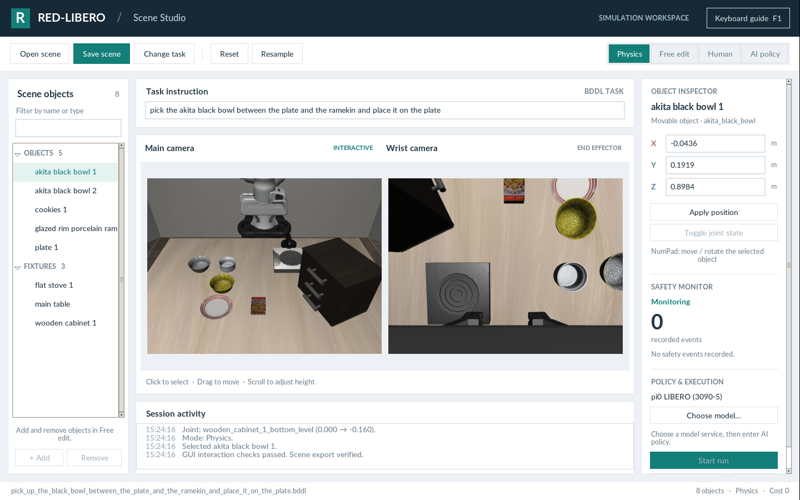

# Scene Studio 使用指南

Scene Studio 是 `editor_gui.py` 默认使用的 Tk/ttk 图形界面，提供双摄像头、场景编辑、安全监控及交互式策略运行。


<h2 id="contents">目录</h2>

1. [启动](#_1)
2. [界面区域](#_2)
3. [四种模式](#_3)
4. [鼠标与快捷键](#_4)
5. [保存与恢复](#_5)
6. [模型服务](#_6)
7. [字体](#_7)
8. [开发验证](#_8)

---

<a id="_1"></a>

## 1. 启动

完成[安装](installation.md)后，在桌面会话的项目根目录执行：

```bash
conda activate red-libero
bash gui_start.sh
```

可以指定任务、模型配置或渲染后端：

```bash
bash gui_start.sh /path/to/task.bddl
bash gui_start.sh /path/to/task.bddl --policy-profile configs/policies/local/my-policy.yaml
bash gui_start_egl.sh /path/to/task.bddl
bash gui_start.sh --classic-ui
```

`RED_LIBERO_PYTHON` 可以指定解释器。启动器使用当前环境，不会自动安装依赖或激活固定环境。默认渲染后端是 OSMesa，资源配置位于 `.gui-runtime/red-libero-config/`。`RED_LIBERO_CONFIG_PATH` 可以覆盖资源目录，`LIBERO_CONFIG_PATH` 保留为兼容回退。工作文件存放在启动目录的 `.red-libero/workspace/`。

Tk 窗口需要桌面显示。模型地址与文件路径均以运行 GUI 的机器为准，远程访问见[相关指南](remote.md)。

<a id="_2"></a>

## 2. 界面区域



| 区域 | 功能 |
| --- | --- |
| 顶部工具栏 | 打开、保存、切换任务、重置、重新采样和模式选择。 |
| Scene objects | 按名称或类型筛选并选择物体或固定设施。 |
| Task instruction | 修改当前会话发送给策略的指令，不会修改 BDDL 目标。 |
| Main camera | 选择、移动物体和检查组合物体部件。 |
| Wrist camera | 查看夹爪及其周围物体。 |
| Object inspector | 使用米为单位修改 XYZ 坐标，切换可用关节状态。 |
| Safety monitor | 查看安全事件，并打开规则树；Free edit 暂停检测。 |
| Policy & execution | 选择服务、开始运行、暂停或继续、回放。 |
| Session activity | 查看操作结果与导出路径；详细日志位于启动终端。 |

建议使用 1440 × 900 或更大的窗口。1280 × 800 也可使用，右侧面板支持滚动。

<a id="_3"></a>

## 3. 四种模式

| 模式 | 行为 |
| --- | --- |
| **Physics** | 推进物理仿真，观察场景。 |
| **Free edit** | 修改物体姿态和场景结构，允许添加或删除物体。 |
| **Human** | 手动控制末端执行器，禁用场景结构编辑。 |
| **AI policy** | 准备策略运行控件，点击 Start run 后开始执行。 |

从 Free edit 切回 Physics 会让场景进行物理稳定。如果需要直接测试编辑后的摆放，可以从 Free edit 进入 AI policy，并通过策略配置控制稳定步数。

AI 执行时，网络请求在后台线程中完成，仿真与绘制仍在 GUI 线程中进行。Pause 冻结执行，有轨迹后才可 Replay。退出并重新进入 AI policy 可以准备新的一轮；退出时恢复点击 Start run 时捕获的场景。

<a id="_4"></a>

## 4. 鼠标与快捷键

使用场景快捷键前先聚焦摄像头。在文本框中输入时不会触发场景快捷键。**F1** 打开完整键盘帮助。

| 输入 | 操作 |
| --- | --- |
| 左键 / 拖动 / 滚轮 | 选择父物体 / 在 XY 平面移动 / 调整高度。 |
| Alt + 左键 | 选择组合物体中的具体部件。 |
| 右键 / Alt + 右键 | 切换父物体关节 / 被点击部件的关节。 |
| NumPad 2/8、6/4、5/0 | 沿 X、Y、Z 平移。 |
| NumPad 7/9、1/3、乘号/除号 | 调整 yaw、pitch、roll。 |
| Shift+S / Shift+I | 在非 AI 模式下保存 / 打开场景。 |
| Shift+R / Shift+E | 在非 AI 模式下重置 / 重新采样。 |
| Shift+A / Shift+Delete | 在 Free edit 中添加 / 删除物体。 |
| Shift+T / Shift+M | 在非 AI 模式下切换任务 / 选择模型。 |
| Ctrl+Enter | 从 Physics 进入 AI policy。 |
| Enter（AI 模式） | 开始已准备好的运行。 |
| P / R（AI 模式） | 暂停或继续 / 回放。 |
| S（AI 运行结束后） | 导出视频、安全事件和 HDF5 轨迹。 |
| 空格 | 切换手动模式或退出 AI 模式。 |

<a id="_5"></a>

## 5. 保存与恢复

**Save scene** 将 `scene.bddl`、`scene.pruned_init`、`scene.meta.yaml` 一起保存到启动目录的 `Scene/<task>_<timestamp>/`。实际路径以活动日志为准。

**Open scene** 加载完整场景包。**Reset** 恢复工作区基准，**Resample** 根据 BDDL 初始化约束生成新样本。结构不同的场景不能随意交换状态文件。

场景导出和策略轨迹导出是不同操作。AI 运行结束后，在退出模式前聚焦摄像头并按 **S**。数据位于项目的 `datasets/video/`、`datasets/rlds/` 和 `datasets/rlds_annotation/`，详见[录制与导出](recording.md)。

<a id="_6"></a>

## 6. 模型服务

`--policy-profile` 参数接收 YAML 文件。兼容别名 `--vla-model` 同样接收 YAML，并非模型权重目录。进入 AI policy 只准备运行，**Start run** 才执行动作。启动服务和连接检查不会执行 GUI 机器人，但连接检查可能发送诊断推理请求。完整协议见[连接与配置](POLICY_SERVICES.md)。

<a id="_7"></a>

## 7. 字体

某些 Conda Tk 构建缺少字体抗锯齿。Ubuntu / Debian x86_64 可以选择使用项目本地 Tk：

```bash
bash scripts/setup_gui_fonts.sh
```

脚本从机器已配置的 APT 源下载 `libtk8.6` 和 `libtcl8.6`，无需 sudo，解压到 `.gui-runtime/tk/`。只影响 GUI 进程；系统仍需 Xft、fontconfig 和字体。设置 `RED_LIBERO_USE_LOCAL_TK=0` 可禁用该覆盖。

<a id="_8"></a>

## 8. 开发验证

持有本地验证文件的维护者可以在独立桌面或 Xvfb 显示会话中运行检查。相关脚本已被 Git 忽略，普通用户无需这些文件即可使用 GUI。检查使用临时场景，不加载模型权重。项目职责划分见[架构说明](GUI_ARCHITECTURE.md)。
