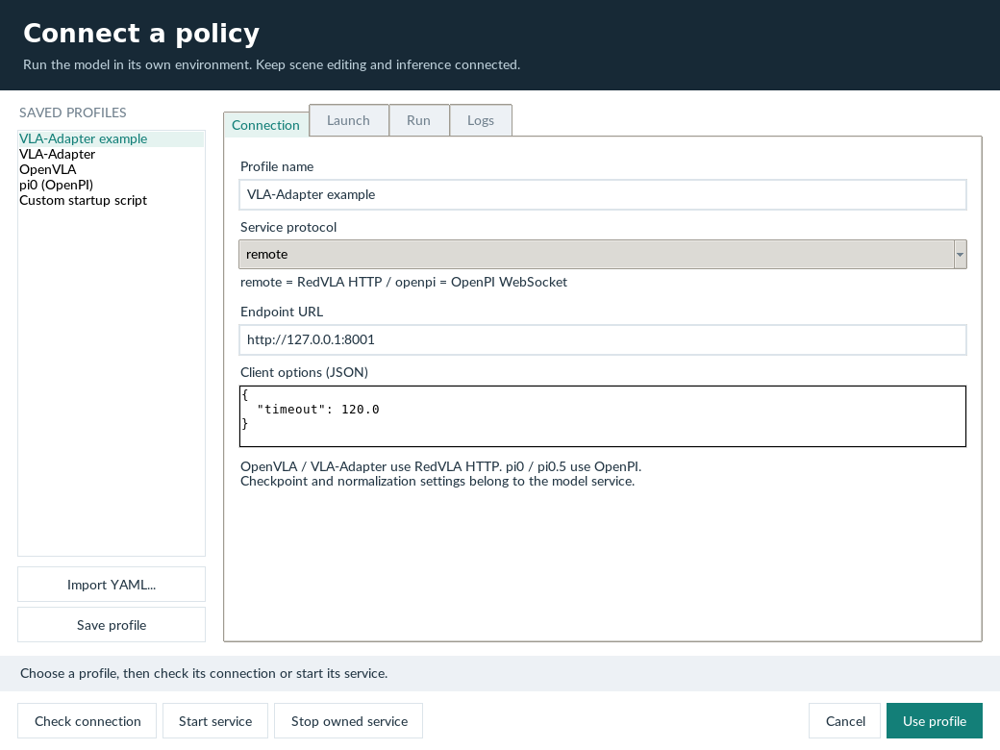
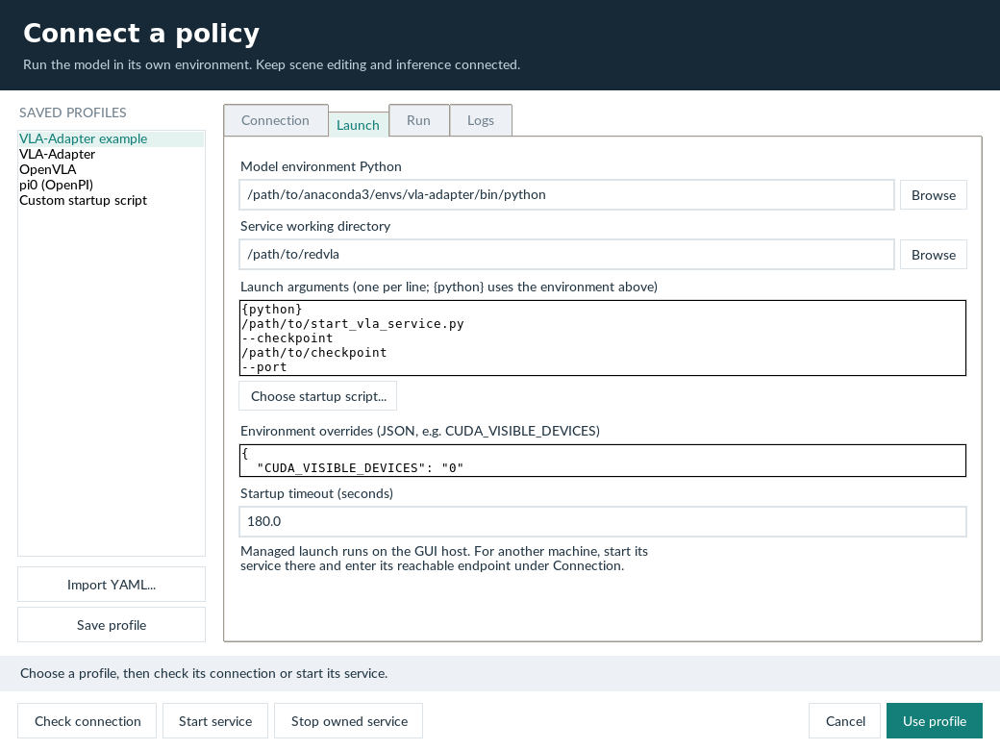
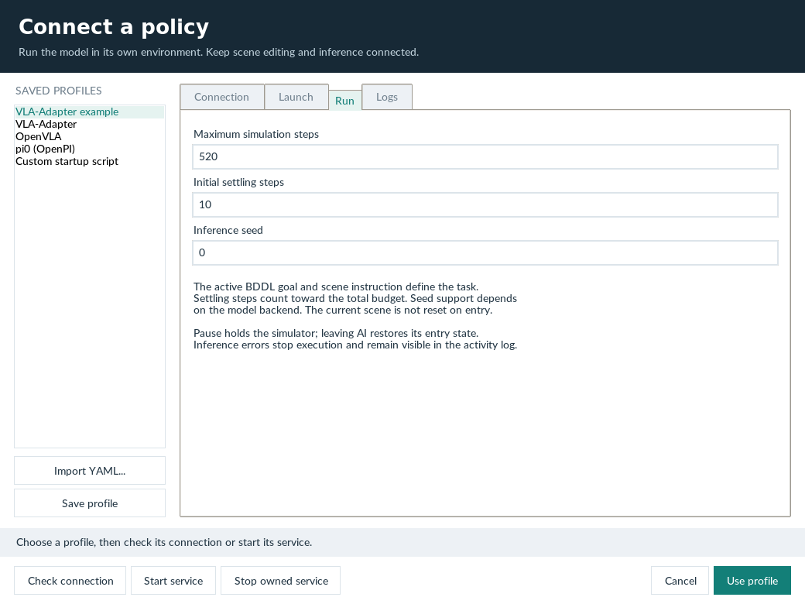

# Connecting VLA policies

Scene Studio uses the **same model factory, observation conversion, and transport clients as RedVLA**. The GUI owns the current Red-LIBERO scene; model weights stay in their own process and Python environment. A profile binds a connection to an optional service launcher.

| Model | GUI protocol | Model process |
| --- | --- | --- |
| OpenVLA | `remote` / HTTP | `redvla serve --model openvla` in the OpenVLA environment |
| VLA-Adapter / Pro / OpenVLA-OFT | `remote` / HTTP | The corresponding `redvla serve` backend in its upstream environment |
| pi0 / pi0.5 | `openpi` / WebSocket | OpenPI's `scripts/serve_policy.py` with the appropriate configuration and checkpoint |
| Custom VLA | Either supported protocol | A custom RedVLA `PolicyModel` served by `redvla serve`, or an OpenPI-compatible service |

<h2 id="contents">Table of Contents</h2>

1. [Install in separate Conda environments](#install-in-separate-conda-environments)
2. [Configure in Choose model](#configure-in-choose-model)
3. [YAML profile](#yaml-profile)
4. [Reuse a RedVLA evaluation configuration](#reuse-a-redvla-evaluation-configuration)
5. [Observation, execution, and failure behavior](#observation-execution-and-failure-behavior)

---

<a id="install-in-separate-conda-environments"></a>

## 1. Install in separate Conda environments

Create the GUI environment using the [installation guide](installation.md). It uses Anaconda/Miniconda, Python 3.10, `numpy==1.26.4`, and `robosuite==1.5.1`. Install this checkout as the `Red-LIBERO` distribution; keep its assets and code together. The `libero.libero` module namespace remains compatible with existing model clients. For the policy client, install the base RedVLA package from the Red-LIBERO root:

```bash
conda activate red-libero
python -m pip install -c requirements/studio.txt -e /path/to/redvla
```

Install each model and its checkpoint following the upstream model's environment requirements. For OpenVLA and VLA-Adapter, also install the lightweight RedVLA package in that model environment:

```bash
/path/to/anaconda3/envs/vla-adapter/bin/python -m pip install -e /path/to/redvla
```

The GUI imports no model backend from that environment. Do not merge conflicting Torch, Transformers, or JAX stacks into the GUI environment. The GUI still requires its documented renderer and desktop dependencies.

<a id="configure-in-choose-model"></a>

## 2. Configure in Choose model

Follow the tabs in order. The screenshots use an example profile; configure your own service before checking the connection.

=== "Connection"

    <figure class="doc-figure" markdown="1">

    [{ loading=lazy width="1040" height="780" }](images/policy-connection.png)

    <figcaption markdown="span">**Connect a policy service.** Select the protocol, endpoint, and timeout. The example uses RedVLA HTTP at a local endpoint; OpenPI uses WebSocket.</figcaption>
    </figure>

=== "Launch"

    <figure class="doc-figure" markdown="1">

    [{ loading=lazy width="1040" height="780" }](images/policy-launch.png)

    <figcaption markdown="span">**Bind the model environment.** Choose the model's Python interpreter and working directory, then specify the startup script and arguments. Replace the illustrated /path/to paths with your own.</figcaption>
    </figure>

=== "Run"

    <figure class="doc-figure" markdown="1">

    [{ loading=lazy width="1040" height="780" }](images/policy-run-settings.png)

    <figcaption markdown="span">**Set the episode budget.** Configure maximum steps, settling steps, and the inference seed. Settling steps count toward the total budget.</figcaption>
    </figure>

1. Open **Choose model** and select a template from `configs/policies/` or **Import YAML**.
2. In **Connection**, set the protocol, endpoint, and client timeout options. Use HTTP for a RedVLA server and WebSocket for an OpenPI server.
3. In **Launch**, choose the Python executable inside the model's Conda environment, its repository working directory, and launch arguments. Each line is one argument; `{python}` expands to the selected interpreter. **Choose startup script** accepts a Python script, shell script, or executable. Add its arguments on subsequent lines. Set `CUDA_VISIBLE_DEVICES` in the environment JSON.
4. Replace checkpoint paths and set the normalization key that actually exists in that checkpoint's statistics. The template's `libero_spatial` is an example, not an automatic task-to-checkpoint mapping.
5. **Start service** launches the process and checks readiness in the background. **Logs** shows its output and service metadata. For an already running service, use **Check connection** instead.
6. **Use profile** saves a machine-local copy and selects it. Switch to **AI policy** to prepare the controls, then click **Start run** (or press Enter with the scene focused) to execute the current scene's instruction and BDDL goal. Entering AI mode leaves the scene unchanged and does not connect to the model, reset an episode, or start recording. A connection check does not execute the robot or reserve an HTTP episode.

Profiles saved by the dialog live in `configs/policies/local/`; the selection and service logs live in `.gui-runtime/`. Both directories are ignored by Git. Templates are examples and must be configured before managed launch. Editing a profile does not alter a running service; stop the owned service before starting one with different model settings. If you select another endpoint, an already launched service remains alive until explicitly stopped or the GUI exits.

The launcher executes an argument list, without shell string interpolation. It adds the selected interpreter's directory to `PATH` and sets `CONDA_PREFIX`; it does **not** run Conda activation hooks. For environments that require activation hooks, use your own shell script with `conda run --no-capture-output -n ENV ...` or explicit activation. Keep the server in the foreground (`exec python ...` in shell scripts); do not daemonize it. GUI-specific Tk preload variables are removed from the child environment.

**Stop owned service** only terminates a process launched by this GUI, including its process group on Linux. It does not kill a server discovered at an endpoint. Closing the dialog leaves an owned service running; closing the GUI stops it. Startup failure, timeout, and cancellation clean up the owned process.

For a service on another host, start it there and configure a reachable endpoint or SSH port forward. Managed launch is restricted to a loopback endpoint on the **GUI host**, which may be the SSH server rather than your local desktop. Set HTTP `REDVLA_API_TOKEN` or OpenPI `OPENPI_API_KEY` in the GUI environment when authentication is enabled. Avoid storing credentials directly in published profiles.

<a id="yaml-profile"></a>

## 3. YAML profile

```yaml
version: 1
name: My VLA
model:
  type: remote
  path: http://127.0.0.1:8001
  options: {timeout: 120}
run: {max_steps: 520, settle_steps: 10, seed: 0}
launch:
  python: /path/to/anaconda3/envs/my-vla/bin/python
  cwd: /path/to/my-vla
  command: ['{python}', /path/to/start_server.py, --port, '8001']
  env: {CUDA_VISIBLE_DEVICES: '0'}
  startup_timeout: 180
```

`launch` is optional for an existing service. Python and working-directory paths may be absolute, home-relative, environment-variable based (`${MODEL_ROOT}`), or relative to the YAML file. Command arguments are passed from the configured working directory. Environment overrides are string values, so quote numeric GPU IDs in YAML.

```bash
conda activate red-libero
bash gui_start.sh /path/to/task.bddl --policy-profile configs/policies/local/My-VLA.yaml
```

`--vla-model` remains an alias for `--policy-profile`, but now expects YAML rather than a checkpoint directory. Existing hardcoded checkpoint presets and synthetic action fallback have been removed.

<a id="reuse-a-redvla-evaluation-configuration"></a>

## 4. Reuse a RedVLA evaluation configuration

**Import YAML** also accepts the evaluator's `models` mapping. Remote entries (`remote`, `openpi`, `pi0`, `pi05`) become GUI profiles. Local weight-loading entries are rejected with a configuration error: serve those models in their own environment first. The GUI imports connection settings and default step budget, not the evaluator's task list or attack configuration. It runs the scene currently open in the editor.

```yaml
models:
  adapter:
    type: remote
    path: http://127.0.0.1:8001
    options: {timeout: 120}
  pi0:
    type: openpi
    path: ws://127.0.0.1:8000
    options: {replan_steps: 8, inference_timeout: 120}
defaults:
  max_steps: 520
```

<a id="observation-execution-and-failure-behavior"></a>

## 5. Observation, execution, and failure behavior

The GUI renders both cameras at 256×256 and obtains proprioception from the **same current simulator**. RedVLA's `from_libero` converts images once to RGB with its 180° orientation convention and produces the 8D end-effector/gripper state. The model service owns preprocessing and normalization. OpenPI's client applies its configured image resize and action replanning length. Returned actions must be finite `[T, 7]` LIBERO OSC commands with the correct gripper convention; the GUI does not renormalize them or invert the gripper again.

Only network operations run in the worker thread. Simulation, safety checks, observation capture, and drawing run on the GUI thread. The full returned action chunk is queued in order, including chunks longer than eight actions. The scene stays visible while inference is pending. Pause and Replay are disabled until execution and a recorded trajectory are available, respectively. Start run is disabled while running and after completion; leave and re-enter AI mode to prepare another run. Pausing freezes execution; leaving AI restores the scene captured at Start run without resetting/resampling fixtures. A pending network call may need its configured timeout to finish closing, but its late reply cannot advance the scene.

Execution stops on BDDL success, environment termination, the step budget, or an error. Settling steps count toward the budget. `seed` is passed as inference context to HTTP backends; honoring it is backend-specific, and standard OpenPI does not accept it on the wire. It does not reseed or resample the edited scene. GUI runs are interactive inspections, not replacements for RedVLA's benchmark evaluation and full reproducibility metadata.

An absent profile or failed connection never produces placeholder actions. HTTP episode leases prevent two clients from sharing one active model episode. Use a separate service per concurrent evaluator. For standard OpenPI, dedicate a service to this GUI while running an episode.

<figure class="doc-figure" markdown="1">

[{ loading=lazy width="1440" height="960" }](images/policy-ready.png)

<figcaption markdown="span">**Start only when ready.** AI policy is prepared, with Start run enabled. No model inference or robot execution has started in this screenshot.</figcaption>
</figure>
