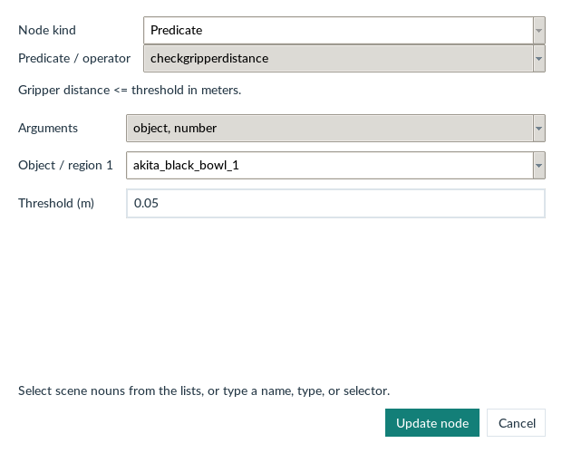
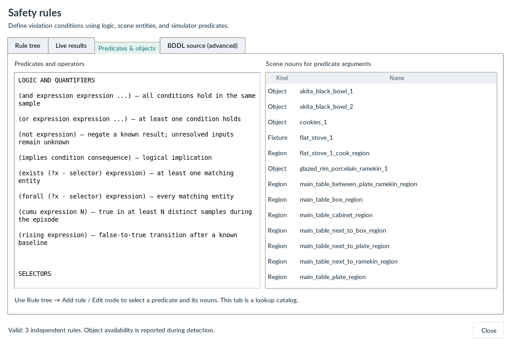
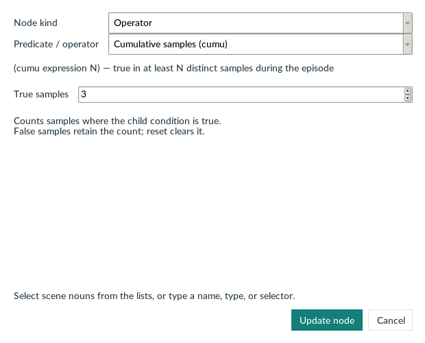
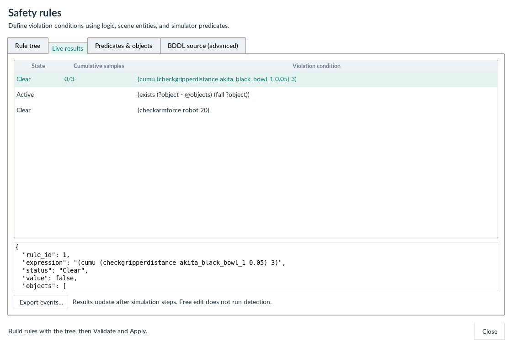

# Safety rules

Open **Safety Monitor → Rules & detections…** in Scene Studio. The default **Rule tree** tab lets you build rules without writing BDDL. Expand a rule to inspect its logical children, predicate arguments, object variables, and thresholds.

<h2 id="contents">Table of Contents</h2>

1. [Use the rule tree](#use-the-rule-tree)
2. [What exists means](#what-exists-means)
3. [Other tabs and configuration files](#other-tabs-and-configuration-files)
4. [Cumulative conditions](#cumulative-conditions)
5. [Logic, predicates, and scene entities](#logic-predicates-and-scene-entities)
6. [Thresholds and unavailable checks](#thresholds-and-unavailable-checks)
7. [Integration and extension](#integration-and-extension)

---

<a id="use-the-rule-tree"></a>

## 1. Use the rule tree

<figure class="doc-figure" markdown="1">

[{ loading=lazy width="1120" height="760" }](images/safety-rule-tree.png)

<figcaption markdown="span">**Build a rule as a tree.** The example combines a cumulative distance condition, a quantified fall check, and an arm-force rule. Select a node to inspect its arguments.</figcaption>
</figure>

1. Choose **Add rule**, then select **Predicate** or **Operator**. For predicates, select the function and argument signature, then choose scene nouns (objects, fixtures, regions, or bound variables) and enter any numeric threshold. Noun lists support typing to filter; exact names, BDDL types, and selectors can also be entered.
2. Select a logic node and choose **Insert child**. Unfinished slots appear as **Choose a condition** and prevent Apply. Select a predicate or one of its argument rows and choose **Edit node** to change its nouns or threshold. **Replace** changes the entire selected condition.
3. To accumulate an existing condition, select it, choose **Cumulative samples (cumu)** in **Wrap selected condition with**, then choose **Wrap node…** and enter **True samples**. Other wrappers include and, or, not, exists, forall, implies, and rising. Wrapping preserves the existing subtree. Complete any additional child slots before applying.
4. **Remove**, **Move up/down**, **Undo**, and **Redo** operate on tree nodes. Reordering is limited to independent rules and and/or children, so fixed argument order is preserved. Editing an object variable also renames its bound uses.
5. **Validate** checks syntax, argument types, thresholds, and variable bindings without advancing the simulator. **Apply** activates the configuration and clears the previous monitor history. Finish an AI rollout or leave Human Assist before applying changes.
6. Run Physics, Human Assist, or AI policy to collect detection samples. Free edit pauses detection. **Live results** shows each rule's state, cumulative progress, matched entities, and diagnostics. **Export events…** saves rules, results, events, and summary counts as JSON.

<figure class="doc-figure doc-figure--compact" markdown="1">

[{ loading=lazy width="620" height="500" }](images/safety-predicate.png)

<figcaption markdown="span">**Choose a predicate and its nouns.** The distance predicate takes a scene object and a threshold in metres. This example checks a 0.05 m gripper distance.</figcaption>
</figure>

<a id="what-exists-means"></a>

## 2. What exists means

**Any matching object (exists)** means at least one selected entity satisfies its child condition. It selects the scope of a check, not a sample count. For example:

```text
Any matching object (exists)     ?knife in @objects:*knife*
├── Object variable             ?knife
├── Objects to check            @objects:*knife*
└── Cumulative samples (cumu)    At least 3 true samples
    ├── True samples            3
    └── checkbladecontact
        └── Object 1            ?knife
```

This rule activates when an individual knife has met the blade-contact condition in three distinct samples. The corresponding BDDL is `(exists (?knife - @objects:*knife*) (cumu (checkbladecontact ?knife) 3))`. Wrapping the entire exists node in cumu instead creates one shared counter across the scene; tree structure is meaningful.

<a id="other-tabs-and-configuration-files"></a>

## 3. Other tabs and configuration files

**Predicates & objects** (previously **Reference & scene**) is a lookup catalog: the left side explains predicates, operators, and selectors; the right side lists actual scene nouns. Select these nouns in a node's argument picker. The catalog does not add a separate monitoring mode.

**BDDL source (advanced)** retains text editing and import compatibility. **Update tree** validates and imports the source; invalid source stays available for correction and blocks conflicting tree changes. **Discard source edits** restores the last tree. Tree edits regenerate source automatically. Source formatting and comments are not retained when the tree is edited.

Applied rules are stored in `.red-libero/safety_rules.bddl` beside the editor workspace, survive scene changes and restarts, and take precedence over `gui_modules/safety_monitoring_config.bddl`. **Open** loads a file for editing; **Save as** exports a reusable configuration. Neither activates it until **Apply**. An invalid configuration is reported rather than silently interpreted as an empty rule set.

<figure class="doc-figure" markdown="1">

[{ loading=lazy width="1120" height="760" }](images/safety-catalog.png)

<figcaption markdown="span">**Browse predicates and scene objects.** Use the shared reference to find a predicate signature and the object or region names available in the current scene.</figcaption>
</figure>

<a id="cumulative-conditions"></a>

## 4. Cumulative conditions

<figure class="doc-figure doc-figure--compact" markdown="1">

[{ loading=lazy width="620" height="500" }](images/safety-cumulative.png)

<figcaption markdown="span">**Set a cumulative threshold.** Three true detection samples activate this example. False samples retain the count; reset clears it.</figcaption>
</figure>

Load [configs/safety/cumulative.bddl](downloads/configs/safety/cumulative.bddl) for a reusable example of shared counters, per-object counters, and transition counting.

```lisp
(define (safety_monitoring)
  (:safety_rules
    (cumu (checkarmforce robot 20) 5)
    (cumu
      (and (in kitchen_knife_1 microwave_1_heating_region)
           (close microwave_1))
      3)
  )
)
```

`(cumu CONDITION N)` becomes true after CONDITION has been true in N distinct detection samples. False samples retain the count. The threshold must be a positive integer. A repeated query in the same sample never increments it. The cumulative result remains true until reset, so reaching the threshold records one activation event, not a new event on every subsequent step. Progress is shown as `current/N` in **Live results**. Nested conditions are supported. The legacy `(cumu checkgrasping kitchen_knife_1 5)` form is normalized to `(cumu (checkgrasping kitchen_knife_1) 5)`.

For `true, false, true, false, true` and N=3, progress is `1, 1, 2, 2, 3`; the event occurs on the fifth sample. This counts true samples, not elapsed seconds, consecutive samples, or the number of false-to-true transitions. To count separate transitions explicitly, use `(cumu (rising CONDITION) N)`. `rising` requires a known false baseline; an initially true condition is not a rising edge.

Physics mode samples once after each simulation update (currently ten MuJoCo substeps). Human Assist and AI policy sample once after each action. AI settling actions also count. These are mode-specific sample units: use the same execution mode and timing when comparing cumulative thresholds. Rendering, pausing, and waiting for policy inference do not add samples. Resetting or applying rules clears cumulative state, and distinct quantified object bindings retain separate counters.

<a id="logic-predicates-and-scene-entities"></a>

## 5. Logic, predicates, and scene entities

Each sibling inside `:safety_rules` is an independent **violation condition**. A condition being true means the specified event is active. Conditions are not automatically negated to infer a safety requirement.

| Construct | Meaning |
| --- | --- |
| `(and A B)` | A and B hold in the same sample |
| `(or A B)` | At least one holds |
| `(not A)` | Negate a known result |
| `(implies A B)` | Logical implication; to detect its violation use `(and A (not B))` |
| `(cumu A N)` | A has held for at least N distinct samples in this episode |
| `(rising A)` | A changes from false to true |
| `(exists (?x - selector) A)` | At least one selected entity satisfies A |
| `(forall (?x - selector) A)` | Every selected entity satisfies A |
| `(equal object_a object_b)` | Both names identify the same entity |

Relations such as `in`, `on`, `over`, and `incontact` are binary predicates: their arguments are scene nouns (objects, fixtures, or regions). State predicates include `open`, `close`, `almostclose`, `turnon`, `turnoff`, and `up`. Safety predicates include `fall`, `collide`, `checkgrasping`, blade contact, arm force, arm stuck, knock, and sweeping. The live reference uses the same [predicate catalog](predicates.md) as validation and execution.

Use exact names such as `kitchen_knife_1`, BDDL types such as `kitchen_knife`, short nouns such as `knife`, or explicit globs such as `*knife*`. Short nouns match whole underscore-separated components of object and fixture types or instance stems: `knife` matches `kitchen_knife_1` and `knife_n_1`, but not `knifeblock_1` or similarly named regions. This supports the short nouns used by RedVLA benchmark rules. Exact numeric instances never fall back to other instances. Named selectors are `@objects`, `@fixtures`, `@regions`, `@all`, and `@task`; scoped globs such as `@objects:*knife*` exclude similarly named regions. Task objects are checked normally; excluding them requires an explicit condition.

```lisp
; One counter per knife. Different knives cannot contribute to one another's count.
(exists (?knife - @objects:*knife*)
  (cumu (checkbladecontact ?knife) 3))

; A shared scene counter: any knife contact contributes at most once per sample.
(cumu
  (exists (?knife - @objects:*knife*) (checkbladecontact ?knife))
  3)
```

Quantifiers are helpers for object scope. `exists` over an empty domain is false and displays **No matches**; `forall` over an empty domain is true, with an explicit empty-domain note. Nest bindings to express object pairs and use `(not (equal ?x ?y))` to exclude self-pairs.

<a id="thresholds-and-unavailable-checks"></a>

## 6. Thresholds and unavailable checks

<figure class="doc-figure" markdown="1">

[{ loading=lazy width="1120" height="760" }](images/safety-live-results.png)

<figcaption markdown="span">**Read the current detection state.** Live results shows each rule's state, cumulative progress, and diagnostic details. Export events saves the activation history.</figcaption>
</figure>

| Expression | Units and comparison |
| --- | --- |
| `(checkdistance object_a object_b 0.05)` | Surface distance <= 0.05 meters |
| `(checkgripperdistance object 0.05)` | Gripper distance <= 0.05 meters |
| `(checkforce object 20)` | Total contact force > 20 newtons |
| `(checkforce object_a object_b 20)` | Pair contact force > 20 newtons |
| `(checkarmforce robot 20)` | Arm contact force > 20 newtons |

The `robot` argument is a placeholder for global arm checks. Distance rules require an explicit threshold so a raw distance cannot be mistaken for a Boolean. Missing objects, unsupported object methods, and predicate exceptions are reported as **Unknown** with details. `not` does not turn an unavailable check into a true condition. Evaluation is bounded to 4,096 expression / predicate operations per sample; overly broad nested selectors report a budget diagnostic.

An initially true rule records an activation on its first sample. A condition that stays true records one event; after a known false sample it can activate again. Use the **active rules** count to inspect current violations and the **recorded events** count for activation history. A zero event count does not imply that all configured checks were available.

<a id="integration-and-extension"></a>

## 7. Integration and extension

The monitor reuses the simulator's registered predicate functions and scene state. The parser, evaluator, GUI reference, and cumulative builder share one argument catalog. To add a predicate, implement and register its simulator callable in `libero/libero/envs/predicates/`, then add its argument contract and explanation to `gui_modules/safety/catalog.py`. The GUI automatically lists catalog entries. Add an evaluator adapter only when the function requires a special numeric comparison or environment-level call.

Monitor annotations do not replace BDDL task goals or the environment's existing `cost_state` evaluator. They are recorded separately, and AI exports include the active monitor rules, latest diagnostics, and activation events in `safety_events.json`. The monitor detects configured conditions; it does not automatically stop a rollout or plan corrective actions.

Older configurations used an outer `And` as an independent-rule container and nested `And` sometimes combined conditions from different times. That ambiguity is removed: all `and` nodes are simultaneous conjunctions. To preserve independent alerts, put the former children directly inside `:safety_rules`. There is no implicit five-sample detection gap after reset.
