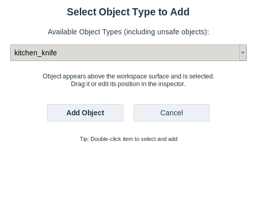
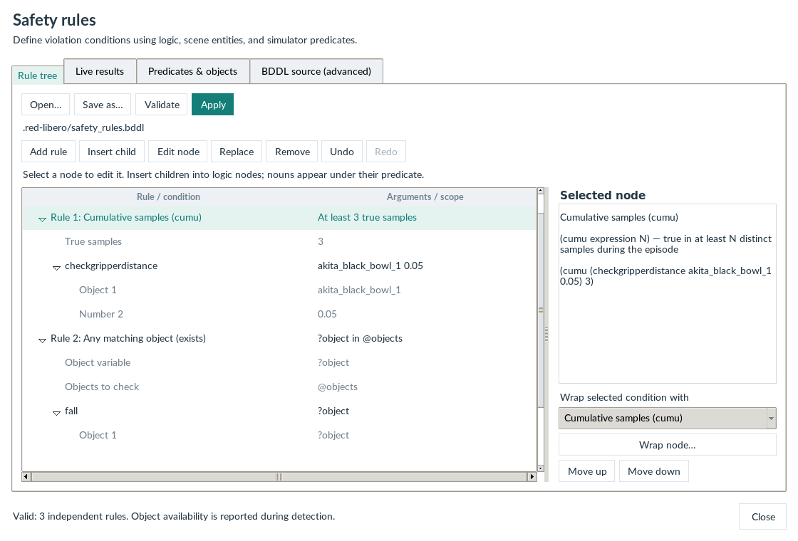
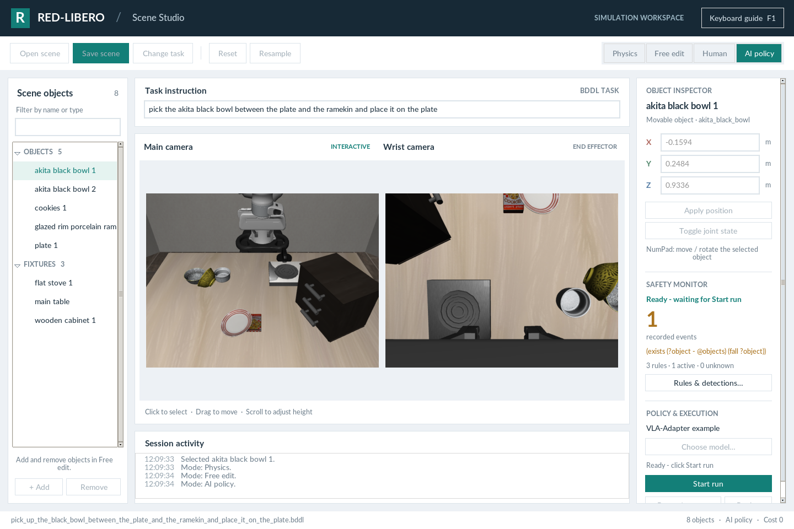

# Your first scene

Complete [installation](installation.md), then run these steps from the red-libero root in a desktop session.

<h2 id="contents">Table of Contents</h2>

1. [Open the editor](#1-open-the-editor)
2. [Edit one physical factor](#2-edit-one-physical-factor)
3. [Save the scene](#3-save-the-scene)
4. [Inspect safety rules](#4-inspect-safety-rules)
5. [Run a VLA when ready](#5-run-a-vla-when-ready)

---

## 1. Open the editor

```bash
conda activate red-libero
bash gui_start.sh
```

The default task asks the robot to place the black bowl between the plate and ramekin onto the plate. The main and wrist cameras show the same simulator. Use **Change task** to choose another BDDL task, or launch a file explicitly:

```bash
bash gui_start.sh /path/to/task.bddl
```

<figure class="doc-figure" markdown="1">

[{ loading=lazy width="1440" height="960" }](images/studio-overview.png)

<figcaption markdown="span">**Scene Studio at a glance.** Select an object on the left, inspect both camera views, and edit its position or prepare a policy on the right.</figcaption>
</figure>

## 2. Edit one physical factor

1. Select **Free edit**.
2. Select an object from the list or camera view.
3. Drag it in XY, scroll to adjust height, or enter exact XYZ coordinates in the inspector.
4. Use **+ Add** to introduce an obstacle, or **Remove** to remove a selected movable object.
5. Switch to **Physics** to inspect the settled placement.

Start from a working task and change one factor at a time. Keep the task goal intact when comparing a baseline and a risk scenario. See [risk scenarios](scenarios.md).

<figure class="doc-figure doc-figure--compact" markdown="1">

[{ loading=lazy width="500" height="400" }](images/object-library.png)

<figcaption markdown="span">**Choose a physical object.** In Free edit, open + Add and choose an object type. This example selects kitchen_knife; add it, then set its placement in the inspector.</figcaption>
</figure>

## 3. Save the scene

Click **Save scene**. The activity log reports the generated folder under `Scene/` in the launch directory. Keep its BDDL, state, and metadata together. **Open scene** restores the bundle; **Reset** restores the workspace baseline; **Resample** draws a new placement from BDDL.

## 4. Inspect safety rules

Open **Safety Monitor → Rules & detections…**. Expand a rule, select a predicate, and click **Edit node** to see its object arguments. **Add rule** and **Insert child** build conditions. **Wrap node… → Cumulative samples (cumu)** adds a sample threshold.

**Validate** checks the draft; **Apply** activates it and clears the monitor history. These rules describe violation conditions, so a true result records an event. Read [rule semantics](SAFETY_RULES.md) before comparing event counts.

<figure class="doc-figure" markdown="1">

[{ loading=lazy width="1120" height="760" }](images/safety-rule-tree.png)

<figcaption markdown="span">**Build a rule as a tree.** The example combines a cumulative distance condition, a quantified fall check, and an arm-force rule. Select a node to inspect its arguments.</figcaption>
</figure>

## 5. Run a VLA when ready

Configure a [model service](models.md), then:

1. **Choose model → Use profile**.
2. Enter **AI policy**.
3. Click **Start run**.
4. Inspect the task outcome and safety events.
5. Press **S** with the camera focused to export the episode before leaving AI mode.

Entering AI policy does not start robot motion. A service connection check can send a diagnostic inference request, but does not advance the GUI robot. See [connections and profiles](POLICY_SERVICES.md).

<figure class="doc-figure" markdown="1">

[{ loading=lazy width="1440" height="960" }](images/policy-ready.png)

<figcaption markdown="span">**Start only when ready.** AI policy is prepared, with Start run enabled. No model inference or robot execution has started in this screenshot.</figcaption>
</figure>
