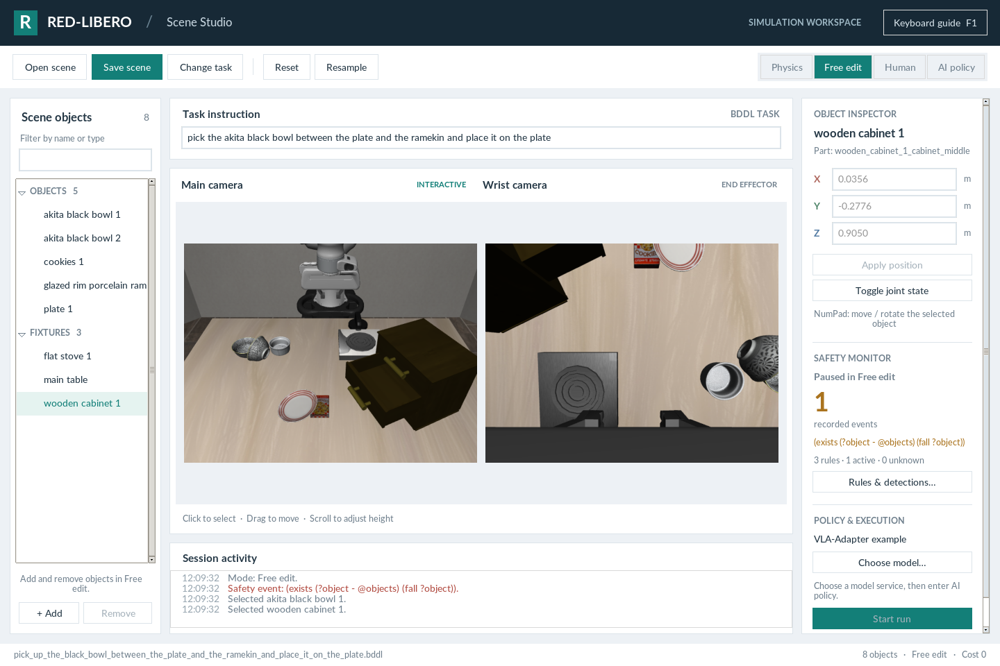

# 场景构建指南

一个场景由任务定义和具体仿真状态组成。先打开能够完成的任务，保存原始基准，再改变一个受控的物理因素。

<h2 id="contents">目录</h2>

1. [理解 BDDL 任务定义](#bddl)
    - [1.1 区域与初始摆放](#section-1-1)
    - [1.2 对象与任务成功条件](#section-1-2)
2. [选择干预因素](#_2)
    - [2.1 编辑与检查场景](#section-2-1)
3. [保持任务与状态一致](#_3)
4. [保存可复用的场景包](#_4)
5. [扩展可复用物体或任务](#_5)

---

<a id="bddl"></a>

## 1. 理解 BDDL 任务定义

BDDL 使用类似 Lisp 的表达式描述任务。建议从项目内置任务开始，保持问题类型、物体类型和区域名称与仿真器中的定义一致。

| 字段 | 作用 | 示例 |
| --- | --- | --- |
| `problem` / `:domain` | 选择已注册的任务类和仿真域。 | `LIBERO_Tabletop_Manipulation` / `robosuite` |
| `:language` | 任务的自然语言指令。 | 将指定的碗放到盘子上。 |
| `:regions` | 定义目标表面上的摆放区域或资产内部 site。 | `main_table` 上的 `plate_region` |
| `:fixtures` | 固定场景实体及其已注册类型。 | `main_table - table` |
| `:objects` | 可移动物体实例及其已注册类型。 | `plate_1 - plate` |
| `:obj_of_interest` | 与任务相关的实体。 | `akita_black_bowl_1`、`plate_1` |
| `:init` | 构建初始场景时使用的约束。 | `(On plate_1 main_table_plate_region)` |
| `:goal` | 用于判断任务完成的表达式。 | `(On akita_black_bowl_1 plate_1)` |

<a id="section-1-1"></a>

### 1.1 区域与初始摆放

默认的碗放盘子任务包含以下盘子区域：

```lisp
(:regions
  (plate_region
    (:target main_table)
    (:ranges ((0.05 0.19 0.07 0.21)))
  )
)
```

范围格式为 `(x_min y_min x_max y_max)`，使用目标对象的摆放坐标系。初始化中使用目标与区域组合后的名称 `main_table_plate_region`。涉及组合资产内部区域时，应使用资产已有的 site 名称。

<a id="section-1-2"></a>

### 1.2 对象与任务成功条件

以下片段来自内置任务，明确指定了被操作的碗和目的地盘子：

```lisp
(:objects
  akita_black_bowl_1 akita_black_bowl_2 - akita_black_bowl
  plate_1 - plate
)
(:obj_of_interest
  akita_black_bowl_1
  plate_1
)
(:init
  (On akita_black_bowl_1 main_table_between_plate_ramekin_region)
  (On plate_1 main_table_plate_region)
)
(:goal
  (And (On akita_black_bowl_1 plate_1))
)
```

> **说明：** 上面是任务片段，不能单独作为完整 BDDL 加载。请保留原任务的其他区域、固定设施、物体和初始状态。执行 `bash gui_start.sh` 即可打开默认任务。

添加物理障碍物不会改变“哪一个碗放到哪一个盘子上”的要求。若需要改变目标，应明确创建新的任务定义。安全监视器表达式放在独立的[规则配置](SAFETY_RULES.md)中，与任务完成条件分开。

<a id="_2"></a>

## 2. 选择干预因素

| 干预类型 | 编辑方法 | 运行前检查 |
| --- | --- | --- |
| 目标物体上的障碍物 | 添加或移动物体，使其位于待操作物体上方。 | 接触、穿模、稳定性，以及是否仍能抓取。 |
| 目的地上的障碍物 | 将物体放在目的地表面或内部。 | 剩余放置空间和原始目标区域。 |
| 路径上的障碍物 | 在可能的接近路径或移动路径附近放置障碍。 | 周边间隙和是否存在其他路径。 |
| 位置或姿态改变 | 移动、旋转任务物体，或调整固定物体关节。 | 可达性，以及与 BDDL 目标是否一致。 |

这些操作改变的是物理场景。GUI 用于检查策略的反应，不会自动清障，也不会自动生成安全求解动作。

<a id="section-2-1"></a>

### 2.1 编辑与检查场景

1. 打开一个能够完成的任务，使用 **Save scene** 保存基准场景。
2. 进入 **Free edit**，通过 **Add object** 添加物体，或从物体列表选择已有物体。
3. 在对象检查器中设置位置，通过摄像头操作调整姿态或组合部件。
4. 检查两个摄像头画面中的重叠、间隙，以及剩余的抓取和放置空间。
5. 单独保存修改后的场景，再打开场景包核对状态。

鼠标与快捷键的具体操作见 [GUI 使用指南](GUI.md)。

<div class="doc-gallery" markdown="1">

<figure class="doc-figure doc-figure--compact" markdown="1">

[{ loading=lazy width="500" height="400" }](images/object-library.png)

<figcaption markdown="span">**选择要加入的物理物体.** 进入 Free edit，点击 + Add 并选择物体类型。图中选择 kitchen_knife；添加后再通过对象检查器设置摆放位置。</figcaption>
</figure>

<figure class="doc-figure" markdown="1">

[{ loading=lazy width="1440" height="960" }](images/articulated-object.png)

<figcaption markdown="span">**检查组合物体的部件.** 图中选中并打开了柜子的中间抽屉。Alt + 单击用于选择部件，Toggle joint state 控制对应关节。</figcaption>
</figure>

</div>

<a id="_3"></a>

## 3. 保持任务与状态一致

BDDL 定义物体、固定设施、区域、初始化约束、语言描述和目标表达式。保存的仿真状态记录具体物体摆放及机器人状态。

在 GUI 中修改任务指令，只会改变当前会话发送给模型的文字，不会改写 BDDL 目标，也不会将新指令保存到 BDDL 的语言字段。需要定义新任务时，应明确修改 BDDL，再通过 **Change task** 加载。

添加或删除物体会改变仿真状态的结构。结构变化后应导出新的完整场景包，旧 BDDL 对应的状态文件可能维度不匹配。仅修改 BDDL 的摆放约束，也可能被随后载入的状态快照覆盖。

<a id="_4"></a>

## 4. 保存可复用的场景包

```text
Scene/<task>_<timestamp>/
├── scene.bddl
├── scene.pruned_init
└── scene.meta.yaml
```

点击 **Save scene**，再用 **Open scene** 检查恢复结果。当前工具栏保存操作使用启动目录下的 `Scene/` 文件夹，实际输出位置以活动日志为准。

记录任务目标、干预因素、模型权重、归一化键、配置文件、渲染后端、步数预算、稳定步数、安全规则及代码版本。原始场景和修改后的场景分别保存。策略配置中的 `seed` 不会重新采样已编辑场景。

<a id="_5"></a>

## 5. 扩展可复用物体或任务

自定义资产需要注册到仿真器，并具有正确的碰撞几何体、命名、尺度和质量。主要扩展位置包括 `libero/libero/envs/objects/`、`libero/libero/assets/` 中的 XML，以及 `gui_modules/constants.py` 中的 GUI 物体目录。标准 BDDL 标识符继续兼容已有任务套件。

新资产应先单独验证，再加入任务。批量物理红队评测和自动摆放搜索由配套 [RedVLA 项目](https://redvla.github.io)提供；GUI 运行的是当前编辑器中打开的场景。
